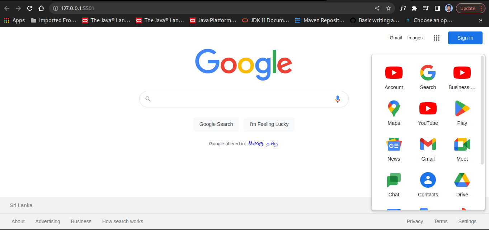

# Google Homepage Clone 

### Basic design of the Google homepage

Google.lk homepage was designed to practice and develop my 
web design skills. This webpage was developed with pure HTML and CSS technologies. 

#### Images of the user interfaces

   

## Used Technologies

- HTML5
- CSS3

#### Used Source-Code Editor
- Visual Studio Code

## How to use ?
This project can be used by cloning the
project to your local machine.

1. Clone the project using `git clone https://github.com/pasanweerawardana/google-clone.git` terminal command.
2. Open the project from **Visual Studio Code**.
3. Run the project using **Live Server**
- Live server can be installed to the VS Code as a extension. Get more details about the Live Server from [Visual Studio Marketplace](https://marketplace.visualstudio.com/items?itemName=ritwickdey.LiveServer).

## Credits
This project was carried out under the guidance of the [IJSE](https://www.ijse.lk/) Direct Entry Program 9.

## License
Copyright &copy; 2023 [Pasan Weerawardana](https://www.linkedin.com/in/pasan-weerawardana-3a4301173/). All Rights Reserved. 
This project is licensed and source code is available to all under the [MIT license](LICENSE.txt).
